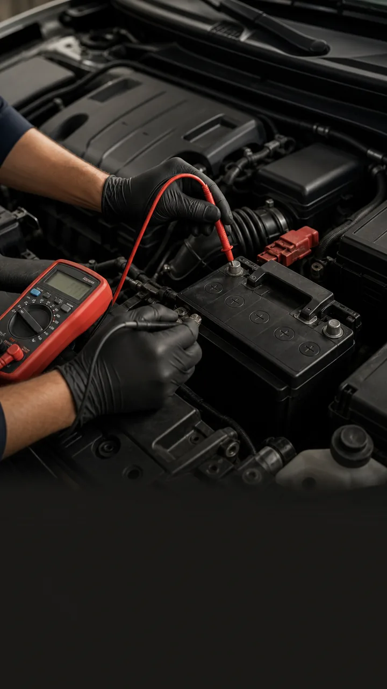

<div align="center">

# 🔧 מסלול רכב | Car Mechanics Course

### קורס מכונאות רכב אינטראקטיבי בעברית — מאגר 19,000+ דגמי רכב


[](https://maslul-rechev-2026.netlify.app)

</div>

---

## 🎯 הבעיה → הפתרון

ללמוד מכונאות רכב בעברית, עם דוגמאות אמיתיות ובלי לשלם על קורס יקר — כמעט בלתי אפשרי. **מסלול רכב** פותר את זה: קורס מכונאות מלא ואינטראקטיבי, עם מאגר נתונים אמיתי של 19,000+ דגמי רכב, סימולציית "מוסך חי" לתרגול מעשי, ובוט WhatsApp שמלווה את הלומד גם מחוץ לאתר.

## 📸 Screenshots

<p align="center">
  
</p>
<p align="center">
  
  
  
  
</p>

## ✨ מה בפרויקט

- 📚 קורס מכונאות מלא בעברית
- 🚗 מאגר נתונים של 19,000+ דגמי רכב
- 🔧 "מוסך חי" — סימולציית תיקון רכב
- 📱 לימוד בווצאפ — בוט אינטראקטיבי
- 💾 PWA — עובד גם ללא אינטרנט

## 🛠️ טכנולוגיות

`HTML5` `CSS3` `JavaScript` `Node.js` `WhatsApp Web.js` `Netlify` `PWA`

## 🌐 דמו חי

**[maslul-rechev-2026.netlify.app](https://maslul-rechev-2026.netlify.app)**

## 📦 הרצה מקומית

```bash
git clone https://github.com/DavidPatlas-AI/maslul-rechev
# פתח index.html בדפדפן
```

**מבנה:**

```
├── index.html              # דף ראשי
├── garage-live.html        # מוסך חי
├── vehicle-database.html   # מאגר רכבים
├── whatsapp-learning.html  # לימוד ווצאפ
├── whatsapp-bot/           # בוט ווצאפ (ריפו נפרד מומלץ)
├── data/                   # נתוני רכבים
└── assets/                 # גרפיקה
```

## 📄 רישיון

MIT © 2026 [David Patlas](https://github.com/DavidPatlas-AI)
